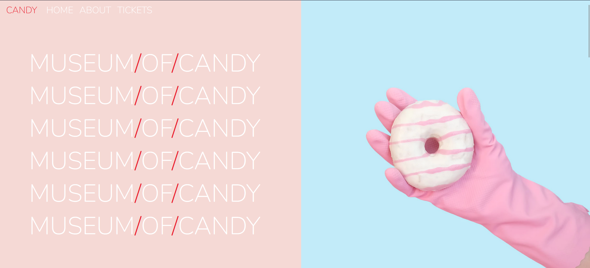
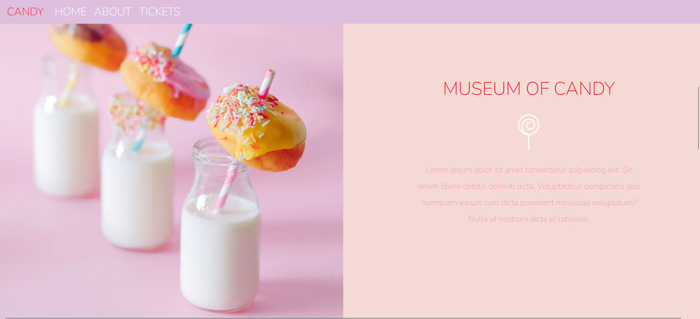

# 🎨 Museum of Candy

A vibrant, responsive single-page landing website built using **HTML**, **CSS**, **Bootstrap 4**, and **jQuery**. This project visually captures the whimsical aesthetic of a fictional candy museum, emphasizing color, layout, and motion.

## ✨ Features

- Sticky top navigation bar with scroll effect
- Fully responsive grid layout using Bootstrap
- Repeating animated headings for bold branding
- Stylized typography and color palette with Google Fonts
- Image sections paired with textual blurbs
- Smooth transition effects via jQuery
- Custom styling through `app.css`

## 📸 Screenshots




## 🚀 Technologies Used

- HTML5
- CSS3 (Custom + Bootstrap 4)
- Google Fonts: *Nunito*
- Images (local assets)

## 🗂️ File Structure

  <pre><code>museum-of-candy/ 
   ├── index.html 
   ├── app.css 
   └── imgs/ </code></pre>


## 🧠 How It Works

- **Navbar scroll effect:** As the user scrolls, jQuery toggles a `.scrolled` class to change navbar background color.
- **Section layout:** Each row alternates between text and image, creating an engaging zigzag layout.
- **Mobile responsiveness:** Bootstrap’s grid system ensures all content adapts across screen sizes.
- **Typography & color scheme:** Custom color palette of soft pinks and reds reinforce a sweet, candy-themed vibe.

## 📦 Installation

1. Clone the repository:
   ```bash
   git clone https://github.com/your-username/museum-of-candy.git
   cd museum-of-candy

2. Open index.html in your browser.
